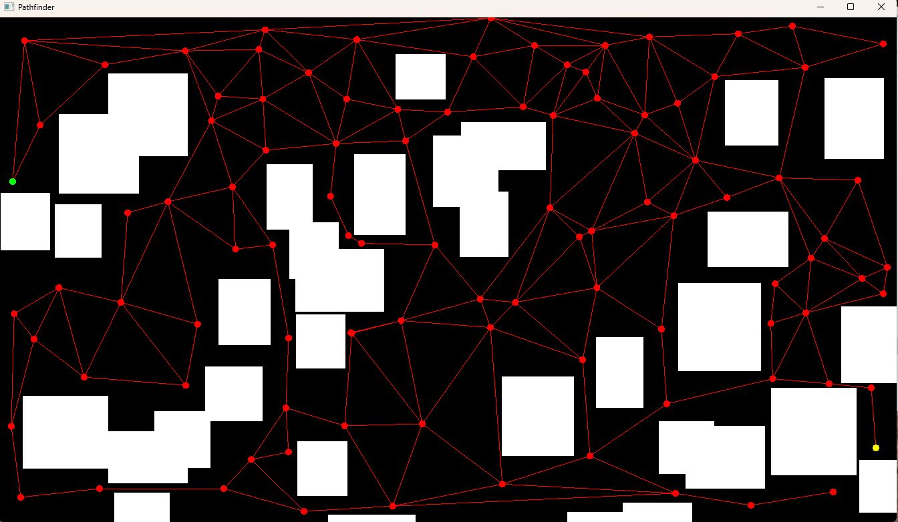

**Pathfinder** 

This project implements Bowyer-Watson's Delauney triangulation algorithm to build a navigation mesh for a randomly generated obstacle course. It also implements the A* pathfinding algorithm to find a path between user-selected start and finish nodes. The visualisations are made with the SFML library. 

To open the project, download the .zip file from the appropriate Release. 
The use the application, follow the instructions in the terminal window. 

